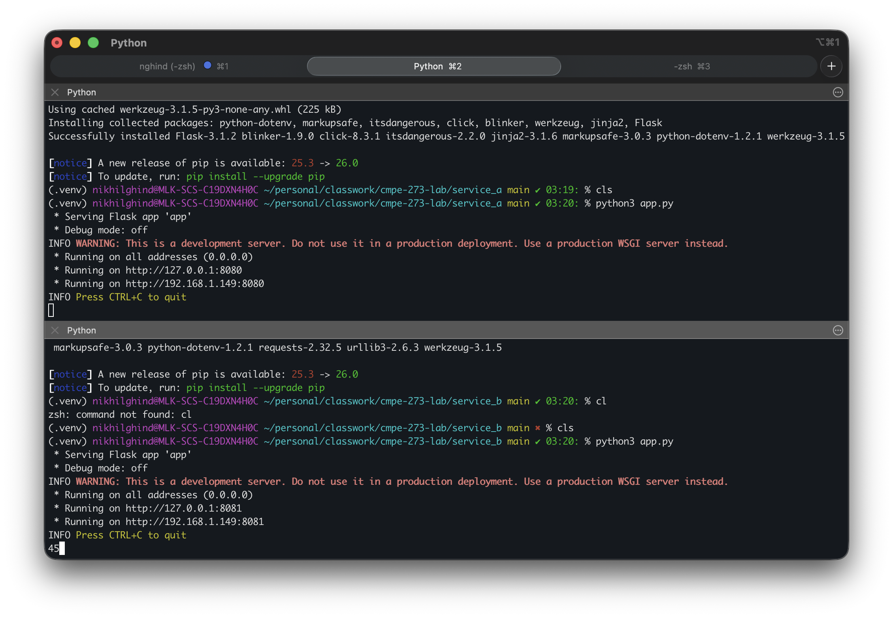
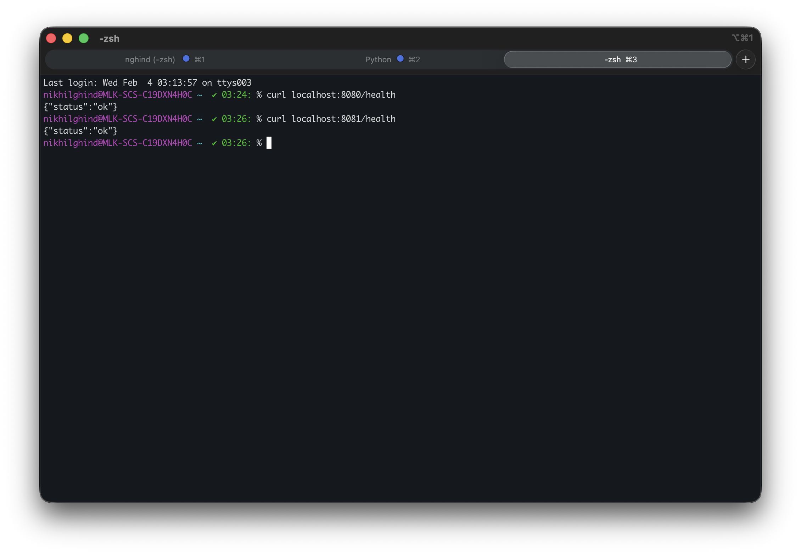
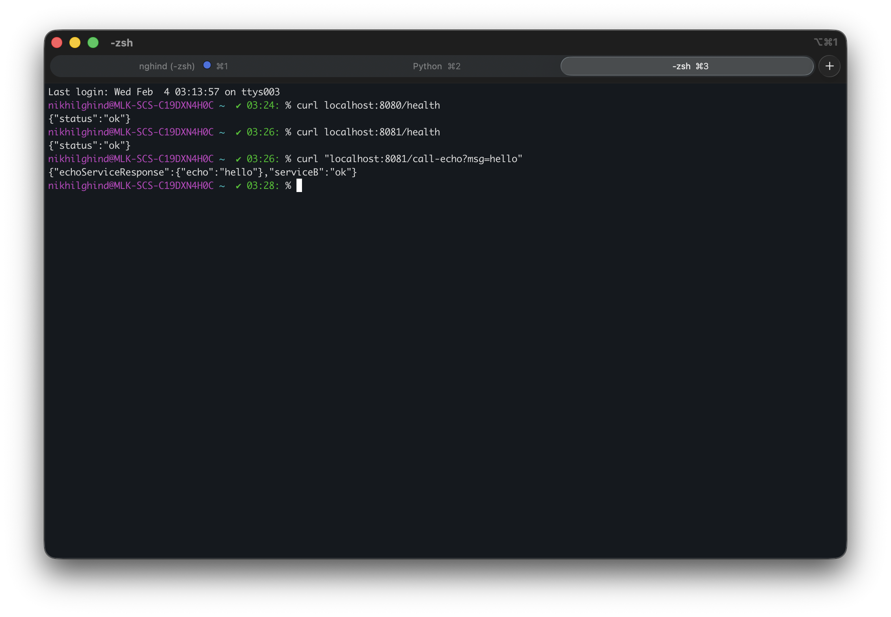
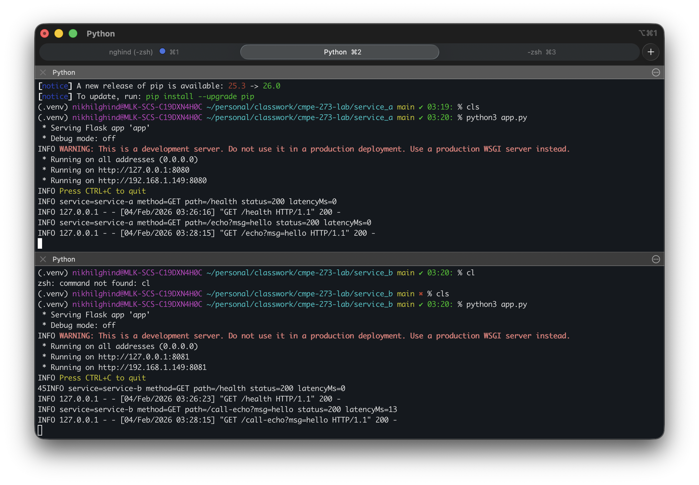
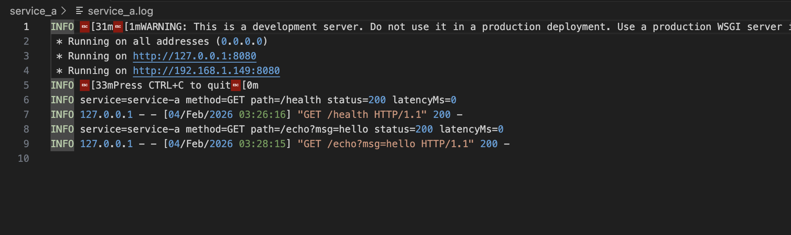
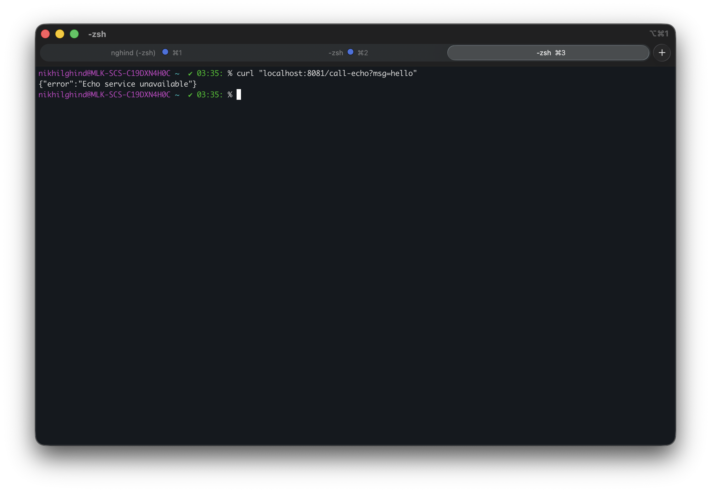
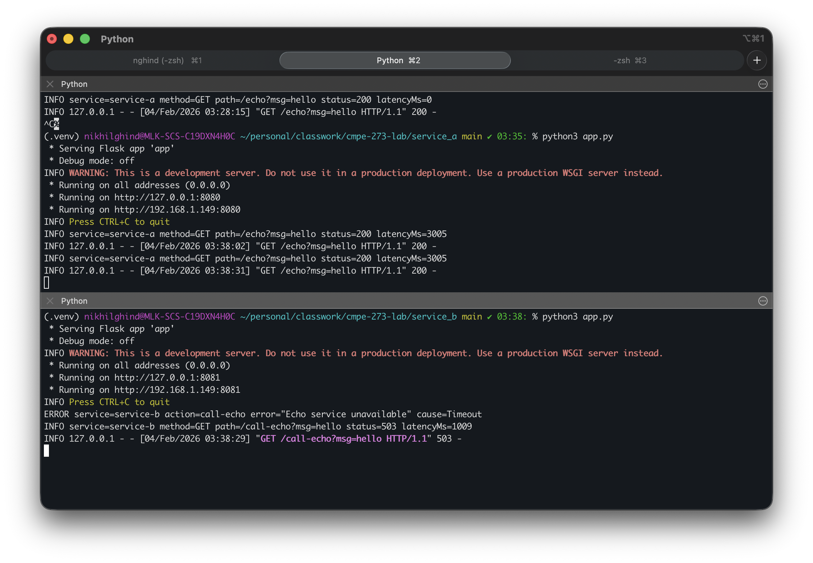

# CMPE 273 Lab - Distributed Services

A locally distributed system with two independent Python services communicating over HTTP REST APIs.

## Prerequisites

- Python 3.10+

## Services

| Service | Port | Description |
|---------|------|-------------|
| Service A | 8080 | Echo API |
| Service B | 8081 | Client that calls Service A |

## Setup & Run

### Terminal 1 - Service A (Echo API)

```bash
cd service_a
python3 -m venv .venv
source .venv/bin/activate
pip install -r requirements.txt
cp .env.example .env  # Configure environment variables
python app.py
```

### Terminal 2 - Service B (Client)

```bash
cd service_b
python3 -m venv .venv
source .venv/bin/activate
pip install -r requirements.txt
cp .env.example .env  # Configure environment variables
python app.py
```

Each service includes a `.env.example` file with default values. Copy it to `.env` and modify as needed.

## Screenshots

### Running Services
Both services started and listening on their respective ports.



### Health Status
Health check endpoints returning successful responses from both services.



### Successful Message
Service B successfully calling Service A's echo endpoint and returning the combined response.



### Both Services Logs
Terminal output showing request logs from both Service A and Service B.



### Log File
Log entries written to the log file as configured in the `.env` file.



### Service A Down
Service B returning HTTP 503 when Service A is unavailable (stopped).



### Service B Timeout
Service B timing out when Service A takes too long to respond (exceeds `ECHO_TIMEOUT_SECONDS`).



## FAQ

### What makes this distributed?

This system is distributed because:

- **Independent Processes**: Service A and Service B run as separate Python processes with their own memory space, not as threads or functions within a single application.
- **Network Communication**: Services communicate over HTTP/TCP rather than direct function calls or shared memory. Service B makes network requests to Service A at `localhost:8080`.
- **Independent Failure**: Each service can fail independently. When Service A crashes, Service B continues running and handles the failure gracefully by returning a 503 error.
- **No Shared State**: Services don't share databases, files, or memory. Each service manages its own state and configuration.
- **Location Transparency**: Service B connects to Service A via a configurable URL (`ECHO_BASE_URL`). The services could run on different machines by simply changing this URL.

While both services run on `localhost` for simplicity, the architecture demonstrates core distributed systems concepts: network-based communication, fault isolation, and independent deployment.

## API Reference

### Service A (Echo API)

#### GET /health
Health check endpoint.

**Response (200):**
```json
{ "status": "ok" }
```

#### GET /echo?msg={message}
Returns the provided message.

**Query Parameters:**
- `msg` (required): The message to echo

**Response (200):**
```json
{ "echo": "hello" }
```

**Response (400 - missing msg):**
```json
{ "error": "msg query param is required" }
```

### Service B (Client)

#### GET /health
Health check endpoint.

**Response (200):**
```json
{ "status": "ok" }
```

#### GET /call-echo?msg={message}
Calls Service A's echo endpoint and returns the response.

**Query Parameters:**
- `msg` (required): The message to send to Service A

**Response (200):**
```json
{
  "serviceB": "ok",
  "echoServiceResponse": { "echo": "hello" }
}
```

**Response (400 - missing msg):**
```json
{ "error": "msg query param is required" }
```

**Response (503 - Service A unavailable):**
```json
{ "error": "Echo service unavailable" }
```

## Testing

```bash
# Health checks
curl localhost:8080/health
curl localhost:8081/health

# Echo endpoint (Service A)
curl "localhost:8080/echo?msg=hello"

# Call-echo endpoint (Service B -> Service A)
curl "localhost:8081/call-echo?msg=hello"
```

## Failure Demonstration

1. Start both services
2. Stop Service A (Ctrl+C)
3. Call Service B:
   ```bash
   curl -i "localhost:8081/call-echo?msg=hello"
   ```
4. Expected: HTTP 503 with `{ "error": "Echo service unavailable" }`

## Logging

Both services log every request with the following format:

```
INFO service=<name> method=<METHOD> path=<PATH> status=<CODE> latencyMs=<N>
```

Example:
```
INFO service=service-a method=GET path=/echo?msg=hello status=200 latencyMs=5
INFO service=service-b method=GET path=/call-echo?msg=hello status=200 latencyMs=12
```

On downstream failure, Service B logs:
```
ERROR service=service-b action=call-echo error="Echo service unavailable" cause=ConnectionError
```

## Environment Variables

### Service A

| Variable | Default | Description |
|----------|---------|-------------|
| SERVICE_NAME | service-a | Name used in logs |
| PORT | 8080 | Server port |
| LOG_FILE | service_a.log | Log file path |

### Service B

| Variable | Default | Description |
|----------|---------|-------------|
| SERVICE_NAME | service-b | Name used in logs |
| PORT | 8081 | Server port |
| ECHO_BASE_URL | http://localhost:8080 | Service A base URL |
| ECHO_TIMEOUT_SECONDS | 1.0 | Timeout for downstream calls |
| LOG_FILE | service_b.log | Log file path |

## Technology Stack

- Python 3.10+
- Flask (web framework)
- requests (HTTP client, Service B only)
- Python built-in logging
